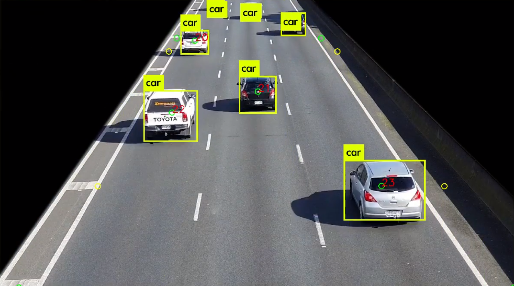

# The University of Auckland 
## Faculty of Engineering, Department of Electrical, Computer Systems, and Software Engineering
### Part IV Project 145. Automated Traffic Monitoring System for Safety and Efficiency, 2019
#### Oliver Kim (@jkim838), Alexander Sye (@asye093)

## Overview

### Introduction

The aim of this project is to develop an automatic traffic monitoring system utilising computer vision. The purpose of the system is to improve safety and efficiency. 

The system shall make quantitative estimates of the traffic state based on the vehicles detected in video frames. The feasibility of various quantitative features will be assessed such as vehicle count, type and speed, as well as considering more abstract features such as accidents or unsafe driving practices.

### Testing Environment

  * OS: Ubuntu 16.04 LTS
  * ROS: Kinetic
  * OpenCV: 3.3.1-dev (ROS Kinetic Install default)
  
  **DESKTOP**
  * CPU: AMD Ryzen™ 7 1700X CPU @ 3.90 GHz
  * GPU: nVidia GTX1080 8GB GP104
  * nVidia Graphics Driver Version: 418.67
  * CUDA Driver Version: 10.1
  * Memory: 16GB
  
  **LAPTOP**
  * CPU: Intel(R) Core(TM) i7-6700HQ CPU @ 2.60 GHz
  * GPU: nVidia GTX1070 8GB GP104M (Mobile)
  * nVidia Graphics Driver Version: 418.67
  * CUDA Driver Version: 10.1
  * Memory: 16GB

## Dependencies

### 1. [YOLO ROS: Real-Time Object Dtection for ROS](https://github.com/leggedrobotics/darknet_ros)

  * #### [OpenCV](https://opencv.org/)

  * #### [Boost (c++ library)](https://www.boost.org/) 

### 2. [video_stream_opencv](https://github.com/jkim838/video_stream_opencv/tree/badebf62ec6718b2e208422a7d529a0396d26350)

### 3. ROS Kinetic

### 4. CUDA Driver (8.0 or above) for YOLO v3 Compatibility

## Installation

### 1. Setting Up ROS Kinetic

For more detail, refer to official installation guide [here](http://wiki.ros.org/kinetic/Installation/Ubuntu)...

#### **1.1. Obtaining ROS**

On Ubuntu terminal,

```
sudo sh -c 'echo "deb http://packages.ros.org/ros/ubuntu $(lsb_release -sc) main" > /etc/apt/sources.list.d/ros-latest.list'

sudo apt-key adv --keyserver 'hkp://keyserver.ubuntu.com:80' --recv-key C1CF6E31E6BADE8868B172B4F42ED6FBAB17C654
```
#### **1.2. Downloading ROS**

Update softwares to current date with following command,
```
sudo apt-get update
```
Install ROS Kinetic with following command, 
```
sudo apt-get install ros-kinetic-desktop-full
```
#### **1.3. Initializing Rosdep**

To automatically install system dependencies for ROS, install Rosdep with following command,
```
sudo rosdep init
rosdep update
```
#### **1.4. Setup Environment**
Automatically add ROS dependencies upon Shell launch,
```
echo "source /opt/ros/kinetic/setup.bash" >> ~/.bashrc
source ~/.bashrc
```
#### **1.5. Install dependencies to building packages**
```
sudo apt install python-rosinstall python-rosinstall-generator python-wstool build-essential
```

### 2. Setting up ROS Workspace

#### **2.1. Creating catkin_ws**

On Ubuntu terminal, create *catkin_ws* folder with following command,

```
cd ~
mkdir -p catkin catkin_ws/src
```
On a new instance of Ubuntu terminal (shortcut **ctrl+shift+N**), launch *roscore* with following command,

```
roscore
```

#### **2.2. Cloning repository**

Back to previous instance of Ubuntu terminal, navigate to *catkin_ws/src* folder with following command and clone this repository,

```
cd catkin_ws/src
git clone --recursive https://github.com/jkim838/145P4P2019.git
cd ..
```

#### **2.3. Building repository**

Build the cloned repository, in *catkin_ws* folder with following command,

```
catkin_make clean
catkin_make -DCATKIN_ENABLE_TESTING=False -DCMAKE_BUILD_TYPE=Release
catkin_make install
echo "source ~/catkin_ws/devel/setup.bash" >> ~/.bashrc
source ~/.bashrc
```

### **3. Downloading YOLO v3 Weights**

Detailed instructions can be found [here](https://pjreddie.com/darknet/yolo/)

On Ubuntu terminal, navigate to darknetROS weights folder with following command,

```
cd ~/catkin_ws/src/145P4P2019/Darknet/darknet_ros/yolo_network_config/weights
```

Download YOLO v3 weights with following command,

```
wget http://pjreddie.com/media/files/yolov3.weights
```

### **4. Launching the program**

Before the program can be launched, configuration file and video footage must be added. 

#### 4.1. Downloading test footage

Test video feed can be downloaded [feed 1](https://drive.google.com/a/aucklanduni.ac.nz/file/d/11DbnBG_t5Tyv-5L1mUAk4-CXi7P1IunO/view?usp=sharing) [feed 2](https://drive.google.com/a/aucklanduni.ac.nz/file/d/17Z0YiTIONWPNcTx-7_iVbtsURefJj_d0/view?usp=sharing) [feed 3](https://drive.google.com/a/aucklanduni.ac.nz/file/d/1lTpoba_gsLt-nPxb-FFMbl5VyYxBuswq/view?usp=sharing)

Copy and paste the video files to *video_stream_opencv* folder, located at *~/catkin_ws/src/145P4P2019/video_stream_opencv*

#### 4.2. Adding configuration file 

Navigate to *~/catkin_ws/src/145P4P2019* folder.

Copy and Paste *ros_video_input_test.yaml* file to *~/catkin_ws/src/145P4P2019/Darknet/darknet_ros/config* 

Navigate back to *~/catkin_ws/src/145P4P2019* folder

On Ubuntu terminal, launch the program with following command:

  * to launch program while recording *.bag* file,

```
roslaunch video_feed.launch
```

  * to launch program without recording *.bag* file,

```
roslaunch video_feed_nobag.launch
```

  * to change the video feed, open the launch file, and change the path to the video file,
  
```
<arg name="video_stream_provider" value="/$PATH_TO_FILE/VIDEOFILE_NAME.mp4" />
```

#### 4.3. Saving Statistics

To save JSON output file, press *s* on the terminal.

To exit program, press *ctrl+c*.

### **5. Using MATLAB Script**

To use MATLAB analyser script on JSON output file, move the JSON file to *MATLAB* folder, located at *~/catkin_ws/src/145P4P2019/MATLAB*

Open MATLAB script *openJSON.m* and change the following code,

```
% define name of file to be opened
fname = '30fps-90sec-sample.json';
```

Run the script to generate statistics.

## Output Example
### Feed 1 Examples



